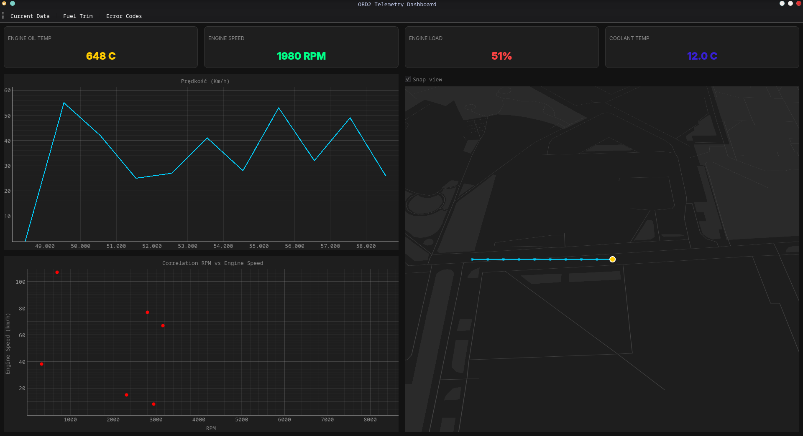
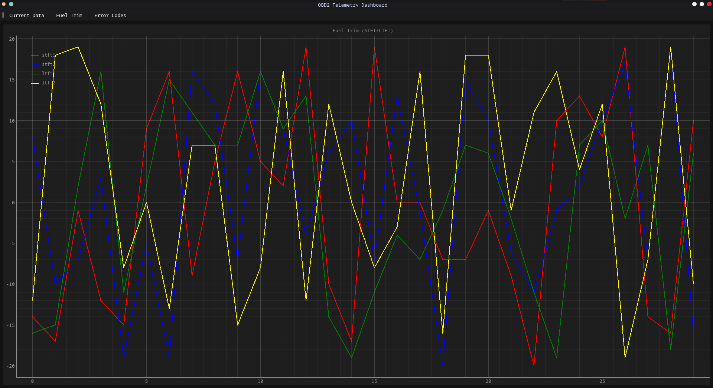

# Dokumentacja projetu: OBD II Telemetry App 

## Zespoł projetowy:
_Kacper Zoła_

## Opis projektu
Aplikacja służąca do analizy danych pozyskiwanych z urządzenia [_OBD II car data reader_](https://github.com/K4-pi/OBD-II-car-data-reader).

## Zakres projektu opis funkcjonalności:
- Komunikacje z urządzeniem pozyskującym dane (UART)
- Dynamiczna wizualizacja danych w formie _grafów_, _kart_ 
- Możliwość eksportowania grafów danych do pliku SVG (_w trakcie pracy_) 

## Panele / zakładki aplikacji

- Telemetry Dashboard:
    - pasek narzędzi
    - karta ciśnienia paliwa
    - karta obrotów silnika
    - karta obciążenia silnika
    - karta temperatury płynu chłodzącego
    - graf prędkości w km/h
    - graf obrotów silnika (w formie procentowej)

- Fuel Trim:
    - pasek narzędzi
    - graf dawki paliwa

- Error Codes (_w trakcie pracy_) 

## Wykorzystane biblioteki:
- PyQt6    -> GUI
- PyQtGraph  -> Do tworzenia grafów danych 
- QSerialPort -> Do komunikacji z urządzeniem czytającym dane
- QtWebEngineWidgets -> Do wyświetlania mapy GPS
- Flask + Sqlite -> Lokalna komunikacja z bazą danych dla mapy GPS
- Numpy -> Obróbka danych

## Instrukcja uruchomienia aplikacji
Aplikacje można uruchomić poprzez użycie interpretera python na plik _main.py_.
